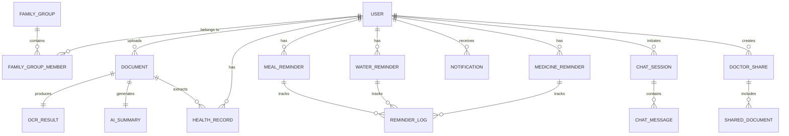

# Maate PRD — Part 2: Technical Architecture & Database Design

## 6. Technical Architecture

### 6.1 High-Level System Architecture

```
┌─────────────────────────────────────────────────────────────────────┐
│                        CLIENT LAYER                                 │
│  ┌──────────────┐  ┌──────────────┐  ┌──────────────────────────┐  │
│  │ React Native │  │  React Web   │  │  Doctor Portal (Next.js) │  │
│  │  iOS + Android│  │  Dashboard   │  │  Read-only patient view  │  │
│  └──────┬───────┘  └──────┬───────┘  └────────────┬─────────────┘  │
└─────────┼─────────────────┼───────────────────────┼─────────────────┘
          │                 │                       │
          ▼                 ▼                       ▼
┌─────────────────────────────────────────────────────────────────────┐
│                      API GATEWAY (Kong / AWS API Gateway)           │
│  Rate Limiting │ Auth │ Request Routing │ API Versioning │ WAF      │
└────────────────────────────────┬────────────────────────────────────┘
                                 │
          ┌──────────────────────┼──────────────────────┐
          ▼                      ▼                      ▼
┌──────────────────┐  ┌──────────────────┐  ┌──────────────────────┐
│  AUTH SERVICE    │  │  CORE SERVICE    │  │  NOTIFICATION SVC    │
│  (Node.js)      │  │  (Node.js)       │  │  (Node.js)           │
│                  │  │                  │  │                      │
│ • JWT/Refresh    │  │ • User CRUD     │  │ • Push (FCM/APNs)    │
│ • OTP (Twilio)   │  │ • Document CRUD │  │ • SMS (Twilio)       │
│ • OAuth 2.0     │  │ • Family Mgmt   │  │ • Scheduler (Bull)   │
│ • RBAC          │  │ • Reminders     │  │ • Escalation Engine  │
└────────┬─────────┘  │ • Timeline      │  └──────────┬───────────┘
         │            │ • Analytics     │              │
         │            └────────┬────────┘              │
         │                     │                       │
         ▼                     ▼                       ▼
┌──────────────────────────────────────────────────────────────────┐
│                      MESSAGE BROKER (Redis + BullMQ)             │
│  Queues: ocr_jobs │ ai_summary │ notifications │ analytics      │
└──────────────────────────────┬───────────────────────────────────┘
                               │
          ┌────────────────────┼────────────────────┐
          ▼                    ▼                    ▼
┌──────────────────┐  ┌──────────────────┐  ┌──────────────────┐
│  OCR SERVICE     │  │  AI SERVICE      │  │  ANALYTICS SVC   │
│  (Python/Fast)   │  │  (Python/Fast)   │  │  (Node.js)       │
│                  │  │                  │  │                  │
│ • Tesseract      │  │ • GPT-4o API    │  │ • Aggregations   │
│ • Google Vision  │  │ • Med NER       │  │ • Trend Calc     │
│ • PDF parsing    │  │ • Summarization │  │ • Risk Scoring   │
│ • Image preproc  │  │ • Chatbot       │  │ • Reports        │
└────────┬─────────┘  └────────┬─────────┘  └────────┬─────────┘
         │                     │                      │
         ▼                     ▼                      ▼
┌──────────────────────────────────────────────────────────────────┐
│                        DATA LAYER                                │
│  ┌─────────────┐  ┌─────────────┐  ┌──────────┐  ┌───────────┐ │
│  │ PostgreSQL  │  │    Redis    │  │   S3     │  │ Pinecone  │ │
│  │ (Primary DB)│  │  (Cache +   │  │ (Docs,  │  │ (Vector   │ │
│  │ + TimescaleDB│  │   Sessions) │  │  Images)│  │  Search)  │ │
│  └─────────────┘  └─────────────┘  └──────────┘  └───────────┘ │
└──────────────────────────────────────────────────────────────────┘
```

### 6.2 Technology Stack

| Layer | Technology | Justification |
|---|---|---|
| **Mobile** | React Native + Expo | Cross-platform, large ecosystem, OTA updates |
| **Web Dashboard** | Next.js 14 (App Router) | SSR, SEO for doctor portal, React ecosystem |
| **API Gateway** | Kong OSS / AWS API Gateway | Rate limiting, auth, routing, WAF |
| **Backend Services** | Node.js 20 + Express/Fastify | Team familiarity, async I/O, npm ecosystem |
| **OCR Service** | Python 3.12 + FastAPI | ML ecosystem, Tesseract/Vision API bindings |
| **AI Service** | Python 3.12 + FastAPI | LangChain, OpenAI SDK, medical NLP libs |
| **Primary Database** | PostgreSQL 16 + TimescaleDB | ACID, JSON support, time-series for vitals |
| **Cache** | Redis 7 (Cluster mode) | Sessions, rate limiting, job queues |
| **Object Storage** | AWS S3 / MinIO | Document & image storage, lifecycle policies |
| **Vector DB** | Pinecone / pgvector | Semantic search over medical documents |
| **Message Queue** | BullMQ (Redis-backed) | Job scheduling, retry logic, priorities |
| **Push Notifications** | FCM + APNs | Native push for Android/iOS |
| **SMS** | Twilio | OTP, escalation alerts |
| **Monitoring** | Prometheus + Grafana + Sentry | Metrics, dashboards, error tracking |
| **CI/CD** | GitHub Actions + ArgoCD | Automated testing, GitOps deployment |
| **Container Orchestration** | Kubernetes (EKS) | Auto-scaling, service mesh, rolling deploys |

---

## 7. Database Entities & Schema

### 7.1 Entity Relationship Diagram



### 7.2 Core Tables

```sql
-- ============================================
-- USERS
-- ============================================
CREATE TABLE users (
    id              UUID PRIMARY KEY DEFAULT gen_random_uuid(),
    phone           VARCHAR(15) UNIQUE,
    email           VARCHAR(255) UNIQUE,
    password_hash   VARCHAR(255),
    full_name       VARCHAR(100) NOT NULL,
    date_of_birth   DATE,
    gender          VARCHAR(10) CHECK (gender IN ('male','female','other')),
    blood_group     VARCHAR(5),
    avatar_url      TEXT,
    locale          VARCHAR(10) DEFAULT 'en-IN',
    timezone        VARCHAR(50) DEFAULT 'Asia/Kolkata',
    onboarding_done BOOLEAN DEFAULT FALSE,
    is_active       BOOLEAN DEFAULT TRUE,
    created_at      TIMESTAMPTZ DEFAULT NOW(),
    updated_at      TIMESTAMPTZ DEFAULT NOW()
);

-- ============================================
-- FAMILY GROUPS
-- ============================================
CREATE TABLE family_groups (
    id          UUID PRIMARY KEY DEFAULT gen_random_uuid(),
    name        VARCHAR(100) NOT NULL,
    created_by  UUID REFERENCES users(id) ON DELETE CASCADE,
    created_at  TIMESTAMPTZ DEFAULT NOW()
);

CREATE TABLE family_group_members (
    id              UUID PRIMARY KEY DEFAULT gen_random_uuid(),
    family_group_id UUID REFERENCES family_groups(id) ON DELETE CASCADE,
    user_id         UUID REFERENCES users(id) ON DELETE CASCADE,
    role            VARCHAR(20) CHECK (role IN ('admin','caregiver','member','dependent')),
    relationship    VARCHAR(30), -- 'parent','spouse','child','self'
    can_view        BOOLEAN DEFAULT TRUE,
    can_edit        BOOLEAN DEFAULT FALSE,
    can_manage_reminders BOOLEAN DEFAULT FALSE,
    joined_at       TIMESTAMPTZ DEFAULT NOW(),
    UNIQUE(family_group_id, user_id)
);

-- ============================================
-- DOCUMENTS
-- ============================================
CREATE TABLE documents (
    id              UUID PRIMARY KEY DEFAULT gen_random_uuid(),
    user_id         UUID REFERENCES users(id) ON DELETE CASCADE,
    uploaded_by     UUID REFERENCES users(id), -- can be family member
    title           VARCHAR(255),
    document_type   VARCHAR(50) CHECK (document_type IN (
        'lab_report','prescription','discharge_summary',
        'imaging','insurance','vaccination','other'
    )),
    file_url        TEXT NOT NULL, -- S3 presigned URL
    file_type       VARCHAR(10), -- pdf, jpg, png
    file_size_bytes BIGINT,
    ocr_status      VARCHAR(20) DEFAULT 'pending' CHECK (ocr_status IN (
        'pending','processing','completed','failed'
    )),
    ai_summary_status VARCHAR(20) DEFAULT 'pending',
    tags            TEXT[], -- PostgreSQL array
    document_date   DATE, -- date on the report
    provider_name   VARCHAR(255), -- hospital/lab name
    doctor_name     VARCHAR(255),
    is_archived     BOOLEAN DEFAULT FALSE,
    created_at      TIMESTAMPTZ DEFAULT NOW(),
    updated_at      TIMESTAMPTZ DEFAULT NOW()
);

CREATE INDEX idx_documents_user_date ON documents(user_id, document_date DESC);
CREATE INDEX idx_documents_type ON documents(user_id, document_type);

-- ============================================
-- OCR RESULTS
-- ============================================
CREATE TABLE ocr_results (
    id              UUID PRIMARY KEY DEFAULT gen_random_uuid(),
    document_id     UUID REFERENCES documents(id) ON DELETE CASCADE,
    raw_text        TEXT,
    structured_data JSONB, -- extracted key-value pairs
    confidence_score DECIMAL(3,2),
    engine_used     VARCHAR(30), -- 'tesseract','google_vision','azure_di'
    processing_time_ms INTEGER,
    created_at      TIMESTAMPTZ DEFAULT NOW()
);

-- ============================================
-- AI SUMMARIES
-- ============================================
CREATE TABLE ai_summaries (
    id              UUID PRIMARY KEY DEFAULT gen_random_uuid(),
    document_id     UUID REFERENCES documents(id) ON DELETE CASCADE,
    summary_text    TEXT NOT NULL,
    key_findings    JSONB, -- [{finding, value, status, reference_range}]
    risk_flags      JSONB, -- [{parameter, severity, recommendation}]
    model_used      VARCHAR(50),
    model_version   VARCHAR(20),
    prompt_tokens   INTEGER,
    completion_tokens INTEGER,
    created_at      TIMESTAMPTZ DEFAULT NOW()
);

-- ============================================
-- HEALTH RECORDS (extracted from documents)
-- ============================================
CREATE TABLE health_records (
    id              UUID PRIMARY KEY DEFAULT gen_random_uuid(),
    user_id         UUID REFERENCES users(id) ON DELETE CASCADE,
    document_id     UUID REFERENCES documents(id),
    record_type     VARCHAR(30), -- 'lab_value','vital','diagnosis','medication','allergy'
    parameter_name  VARCHAR(100), -- 'HbA1c','Blood Pressure','Cholesterol'
    value           VARCHAR(50),
    unit            VARCHAR(30),
    reference_min   DECIMAL(10,2),
    reference_max   DECIMAL(10,2),
    status          VARCHAR(20) CHECK (status IN ('normal','low','high','critical')),
    recorded_date   DATE NOT NULL,
    loinc_code      VARCHAR(20), -- FHIR compatibility
    snomed_code     VARCHAR(20),
    created_at      TIMESTAMPTZ DEFAULT NOW()
);

CREATE INDEX idx_health_records_user_param ON health_records(user_id, parameter_name, recorded_date DESC);

-- ============================================
-- MEDICINE REMINDERS
-- ============================================
CREATE TABLE medicine_reminders (
    id              UUID PRIMARY KEY DEFAULT gen_random_uuid(),
    user_id         UUID REFERENCES users(id) ON DELETE CASCADE,
    created_by      UUID REFERENCES users(id), -- family member can create
    medicine_name   VARCHAR(255) NOT NULL,
    dosage          VARCHAR(100), -- '500mg', '1 tablet'
    frequency       VARCHAR(30) CHECK (frequency IN (
        'once_daily','twice_daily','thrice_daily',
        'four_times','weekly','custom'
    )),
    times_of_day    TIME[], -- [07:00, 14:00, 21:00]
    days_of_week    INTEGER[], -- [1,2,3,4,5,6,7] for custom
    meal_relation   VARCHAR(20) CHECK (meal_relation IN ('before_meal','after_meal','with_meal','any')),
    start_date      DATE NOT NULL,
    end_date        DATE,
    instructions    TEXT,
    is_active       BOOLEAN DEFAULT TRUE,
    snooze_minutes  INTEGER DEFAULT 15,
    escalate_after  INTEGER DEFAULT 30, -- minutes before alerting family
    created_at      TIMESTAMPTZ DEFAULT NOW(),
    updated_at      TIMESTAMPTZ DEFAULT NOW()
);

-- ============================================
-- WATER REMINDERS
-- ============================================
CREATE TABLE water_reminders (
    id              UUID PRIMARY KEY DEFAULT gen_random_uuid(),
    user_id         UUID REFERENCES users(id) ON DELETE CASCADE,
    daily_goal_ml   INTEGER DEFAULT 2500,
    interval_minutes INTEGER DEFAULT 90,
    active_start    TIME DEFAULT '07:00',
    active_end      TIME DEFAULT '21:00',
    glass_size_ml   INTEGER DEFAULT 250,
    is_active       BOOLEAN DEFAULT TRUE,
    created_at      TIMESTAMPTZ DEFAULT NOW()
);

-- ============================================
-- MEAL REMINDERS
-- ============================================
CREATE TABLE meal_reminders (
    id              UUID PRIMARY KEY DEFAULT gen_random_uuid(),
    user_id         UUID REFERENCES users(id) ON DELETE CASCADE,
    meal_type       VARCHAR(20) CHECK (meal_type IN ('breakfast','lunch','snack','dinner')),
    scheduled_time  TIME NOT NULL,
    dietary_notes   TEXT,
    is_active       BOOLEAN DEFAULT TRUE,
    created_at      TIMESTAMPTZ DEFAULT NOW()
);

-- ============================================
-- REMINDER LOGS (unified for all reminder types)
-- ============================================
CREATE TABLE reminder_logs (
    id              UUID PRIMARY KEY DEFAULT gen_random_uuid(),
    user_id         UUID REFERENCES users(id) ON DELETE CASCADE,
    reminder_type   VARCHAR(20) CHECK (reminder_type IN ('medicine','water','meal')),
    reminder_id     UUID NOT NULL, -- FK to respective reminder table
    scheduled_at    TIMESTAMPTZ NOT NULL,
    delivered_at    TIMESTAMPTZ,
    responded_at    TIMESTAMPTZ,
    response        VARCHAR(20) CHECK (response IN ('taken','skipped','snoozed','missed')),
    escalated       BOOLEAN DEFAULT FALSE,
    escalated_to    UUID REFERENCES users(id),
    notes           TEXT,
    created_at      TIMESTAMPTZ DEFAULT NOW()
);

CREATE INDEX idx_reminder_logs_user_date ON reminder_logs(user_id, scheduled_at DESC);

-- ============================================
-- DOCTOR SHARES
-- ============================================
CREATE TABLE doctor_shares (
    id              UUID PRIMARY KEY DEFAULT gen_random_uuid(),
    user_id         UUID REFERENCES users(id) ON DELETE CASCADE,
    share_token     VARCHAR(64) UNIQUE NOT NULL,
    doctor_name     VARCHAR(255),
    doctor_email    VARCHAR(255),
    doctor_phone    VARCHAR(15),
    access_level    VARCHAR(20) DEFAULT 'read_only',
    expires_at      TIMESTAMPTZ NOT NULL,
    is_revoked      BOOLEAN DEFAULT FALSE,
    accessed_count  INTEGER DEFAULT 0,
    last_accessed   TIMESTAMPTZ,
    created_at      TIMESTAMPTZ DEFAULT NOW()
);

-- ============================================
-- CHAT SESSIONS
-- ============================================
CREATE TABLE chat_sessions (
    id              UUID PRIMARY KEY DEFAULT gen_random_uuid(),
    user_id         UUID REFERENCES users(id) ON DELETE CASCADE,
    title           VARCHAR(255),
    context_type    VARCHAR(30), -- 'general','document_specific','health_query'
    context_ref_id  UUID, -- optional reference to a document
    is_active       BOOLEAN DEFAULT TRUE,
    created_at      TIMESTAMPTZ DEFAULT NOW()
);

CREATE TABLE chat_messages (
    id              UUID PRIMARY KEY DEFAULT gen_random_uuid(),
    session_id      UUID REFERENCES chat_sessions(id) ON DELETE CASCADE,
    role            VARCHAR(10) CHECK (role IN ('user','assistant','system')),
    content         TEXT NOT NULL,
    metadata        JSONB, -- sources, citations, confidence
    tokens_used     INTEGER,
    created_at      TIMESTAMPTZ DEFAULT NOW()
);

-- ============================================
-- NOTIFICATIONS
-- ============================================
CREATE TABLE notifications (
    id              UUID PRIMARY KEY DEFAULT gen_random_uuid(),
    user_id         UUID REFERENCES users(id) ON DELETE CASCADE,
    type            VARCHAR(30), -- 'reminder','alert','info','escalation'
    channel         VARCHAR(20), -- 'push','sms','in_app'
    title           VARCHAR(255),
    body            TEXT,
    data            JSONB,
    status          VARCHAR(20) DEFAULT 'pending',
    sent_at         TIMESTAMPTZ,
    read_at         TIMESTAMPTZ,
    created_at      TIMESTAMPTZ DEFAULT NOW()
);
```

---

## 8. API Architecture

### 8.1 API Design Principles

- **RESTful** with OpenAPI 3.1 spec
- **Versioned**: `/api/v1/...`
- **JSON:API** response format with pagination
- **JWT + Refresh Token** authentication
- **Rate Limited**: 100 req/min (free), 1000 req/min (premium)
- **Idempotent** POST operations via `Idempotency-Key` header

### 8.2 Core API Endpoints

```yaml
# ==========================================
# AUTH
# ==========================================
POST   /api/v1/auth/send-otp          # Send OTP to phone/email
POST   /api/v1/auth/verify-otp        # Verify OTP, return JWT
POST   /api/v1/auth/refresh            # Refresh access token
POST   /api/v1/auth/logout             # Revoke refresh token
DELETE /api/v1/auth/account            # Delete account (GDPR/DPDP)

# ==========================================
# USER PROFILE
# ==========================================
GET    /api/v1/users/me                # Get current user profile
PATCH  /api/v1/users/me                # Update profile
PUT    /api/v1/users/me/avatar         # Upload avatar

# ==========================================
# DOCUMENTS
# ==========================================
POST   /api/v1/documents/upload        # Upload document (multipart)
GET    /api/v1/documents               # List documents (paginated, filtered)
GET    /api/v1/documents/:id           # Get document details
GET    /api/v1/documents/:id/ocr       # Get OCR result
GET    /api/v1/documents/:id/summary   # Get AI summary
DELETE /api/v1/documents/:id           # Soft delete document
POST   /api/v1/documents/:id/retry-ocr # Retry failed OCR
PATCH  /api/v1/documents/:id/ocr       # Manual correction of OCR data

# ==========================================
# REMINDERS — MEDICINE
# ==========================================
POST   /api/v1/reminders/medicine      # Create medicine reminder
GET    /api/v1/reminders/medicine      # List all medicine reminders
GET    /api/v1/reminders/medicine/:id  # Get specific reminder
PATCH  /api/v1/reminders/medicine/:id  # Update reminder
DELETE /api/v1/reminders/medicine/:id  # Delete reminder
POST   /api/v1/reminders/medicine/:id/log  # Log response (taken/skipped)

# ==========================================
# REMINDERS — WATER
# ==========================================
GET    /api/v1/reminders/water         # Get water config
PUT    /api/v1/reminders/water         # Update water config
POST   /api/v1/reminders/water/log     # Log water intake
GET    /api/v1/reminders/water/today   # Get today's intake summary

# ==========================================
# REMINDERS — MEAL
# ==========================================
POST   /api/v1/reminders/meal          # Create meal reminder
GET    /api/v1/reminders/meal          # List meal reminders
PATCH  /api/v1/reminders/meal/:id      # Update meal reminder
POST   /api/v1/reminders/meal/:id/log  # Log meal taken

# ==========================================
# HEALTH TIMELINE
# ==========================================
GET    /api/v1/timeline                # Get health timeline (paginated)
GET    /api/v1/timeline/summary        # Get timeline summary stats

# ==========================================
# HEALTH ANALYTICS
# ==========================================
GET    /api/v1/analytics/trends        # Get parameter trends
GET    /api/v1/analytics/adherence     # Medication adherence stats
GET    /api/v1/analytics/intake        # Water/meal intake stats
GET    /api/v1/analytics/risk-score    # Overall health risk score

# ==========================================
# FAMILY MANAGEMENT
# ==========================================
POST   /api/v1/family/groups           # Create family group
GET    /api/v1/family/groups           # List user's family groups
POST   /api/v1/family/groups/:id/members    # Add member (invite)
DELETE /api/v1/family/groups/:id/members/:uid # Remove member
PATCH  /api/v1/family/groups/:id/members/:uid # Update permissions
GET    /api/v1/family/dependents/:uid/timeline  # View dependent's timeline

# ==========================================
# DOCTOR SHARING
# ==========================================
POST   /api/v1/shares                  # Create share link
GET    /api/v1/shares                  # List active shares
DELETE /api/v1/shares/:id              # Revoke share
GET    /api/v1/shared/:token           # Doctor accesses shared data (no auth)

# ==========================================
# CHATBOT
# ==========================================
POST   /api/v1/chat/sessions           # Start new chat session
GET    /api/v1/chat/sessions           # List chat sessions
POST   /api/v1/chat/sessions/:id/messages   # Send message
GET    /api/v1/chat/sessions/:id/messages   # Get chat history

# ==========================================
# NOTIFICATIONS
# ==========================================
GET    /api/v1/notifications           # List notifications
PATCH  /api/v1/notifications/:id/read  # Mark as read
POST   /api/v1/notifications/register-device  # Register FCM/APNs token
```

### 8.3 Request/Response Examples

```json
// POST /api/v1/documents/upload
// Request: multipart/form-data
{
  "file": "<binary>",
  "document_type": "lab_report",
  "document_date": "2026-04-15",
  "provider_name": "Apollo Diagnostics",
  "tags": ["blood_test", "quarterly_checkup"]
}

// Response: 201 Created
{
  "data": {
    "id": "d7f3a1b2-...",
    "type": "document",
    "attributes": {
      "title": "Blood Test Report - Apollo Diagnostics",
      "document_type": "lab_report",
      "ocr_status": "processing",
      "ai_summary_status": "pending",
      "file_url": null,
      "created_at": "2026-05-07T10:30:00Z"
    }
  },
  "meta": {
    "estimated_processing_time": "10s"
  }
}
```
